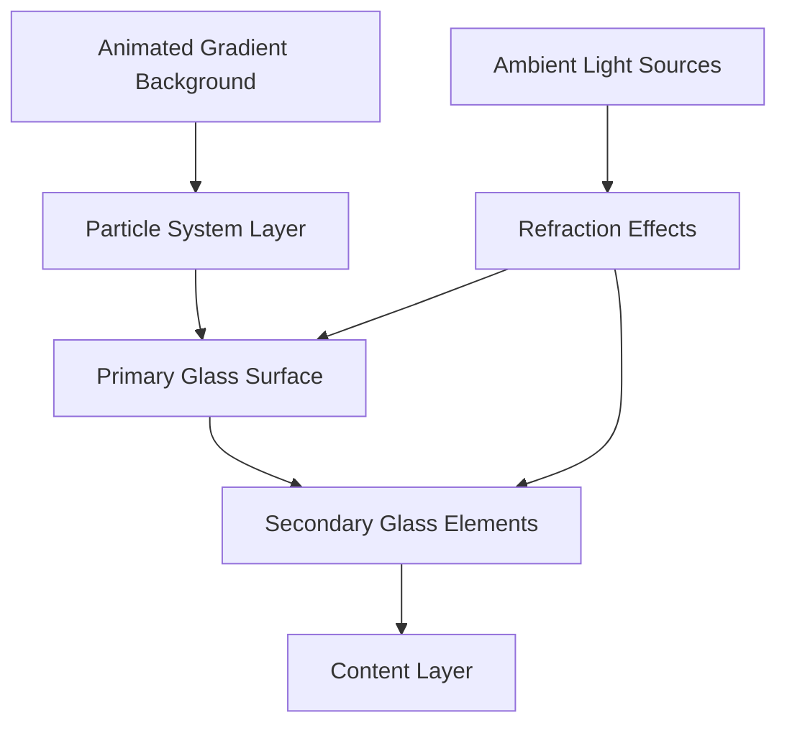
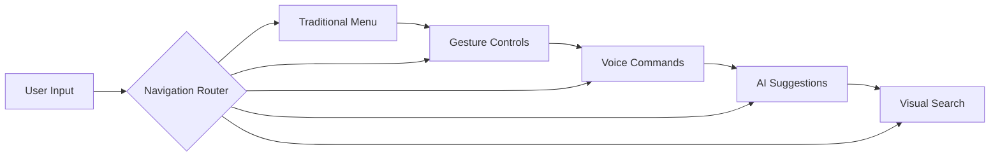
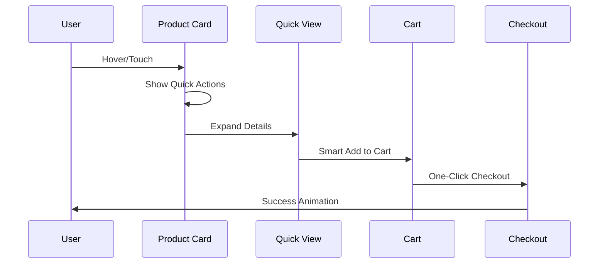
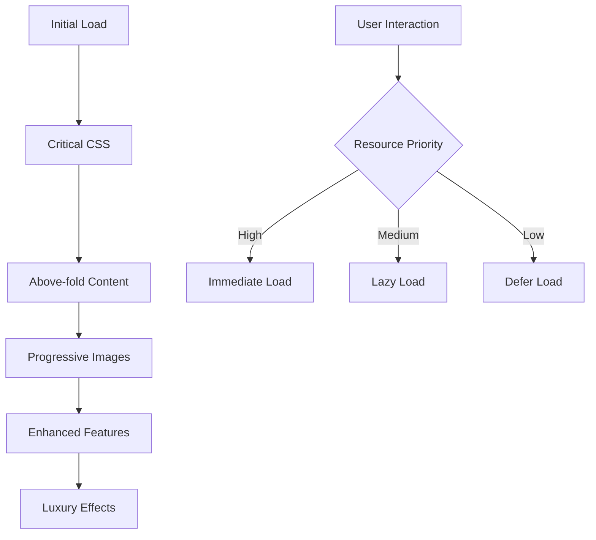

# Ultra Glass Design Blueprint - Southwest Mushrooms Premium Theme

## 🎨 Design Philosophy

### Core Principles
1. **Ethereal Transparency**: Multi-layered glass effects creating depth and sophistication
2. **Intuitive Flow**: Predictive navigation with gesture-based interactions
3. **Premium Minimalism**: Clean, spacious layouts focusing on product storytelling
4. **Conversion Psychology**: Strategic use of micro-interactions and visual hierarchy
5. **Timeless Elegance**: Design that ages gracefully with subtle trend adaptations

## 🔮 Glass Design System

### 1. Advanced Glass Morphism Layers

```scss
// Ultra Glass Design Tokens
$glass-levels: (
  'surface': (
    blur: 20px,
    opacity: 0.7,
    border: 1px solid rgba(255, 255, 255, 0.18),
    shadow: 0 8px 32px 0 rgba(31, 38, 135, 0.15)
  ),
  'elevated': (
    blur: 40px,
    opacity: 0.8,
    border: 1px solid rgba(255, 255, 255, 0.25),
    shadow: 0 16px 48px 0 rgba(31, 38, 135, 0.2)
  ),
  'floating': (
    blur: 60px,
    opacity: 0.85,
    border: 2px solid rgba(255, 255, 255, 0.3),
    shadow: 0 24px 64px 0 rgba(31, 38, 135, 0.25)
  )
);
```

### 2. Dynamic Background System



### 3. Glass Component Architecture

#### Hero Glass Card
```scss
.ultra-glass-card {
  // Base glass effect
  backdrop-filter: blur(40px) saturate(180%);
  -webkit-backdrop-filter: blur(40px) saturate(180%);
  background: linear-gradient(
    135deg,
    rgba(255, 255, 255, 0.1) 0%,
    rgba(255, 255, 255, 0.05) 100%
  );
  
  // Iridescent border
  border: 1px solid transparent;
  background-clip: padding-box;
  
  &::before {
    content: '';
    position: absolute;
    inset: 0;
    border-radius: inherit;
    padding: 1px;
    background: linear-gradient(
      45deg,
      rgba(255, 255, 255, 0.4),
      rgba(255, 255, 255, 0.1),
      rgba(255, 255, 255, 0.4)
    );
    mask: linear-gradient(#fff 0 0) content-box, 
          linear-gradient(#fff 0 0);
    mask-composite: exclude;
  }
}
```

## 🧭 Enhanced Navigation System

### 1. Predictive Navigation AI

```javascript
class PredictiveNavigation {
  constructor() {
    this.userBehavior = new UserBehaviorAnalytics();
    this.suggestions = new SmartSuggestions();
    this.preloader = new IntelligentPreloader();
  }
  
  features = {
    // Anticipate user's next action
    predictivePreloading: true,
    
    // Smart search with visual results
    visualSearchSuggestions: true,
    
    // Gesture-based shortcuts
    gestureNavigation: {
      swipeUp: 'quickCart',
      swipeDown: 'search',
      pinch: 'zoomProduct',
      longPress: 'quickView'
    },
    
    // Voice navigation
    voiceCommands: true
  };
}
```

### 2. Multi-Dimensional Navigation



### 3. Floating Navigation Orbs

```scss
.nav-orb-system {
  position: fixed;
  bottom: 2rem;
  right: 2rem;
  
  .primary-orb {
    width: 60px;
    height: 60px;
    backdrop-filter: blur(20px);
    background: radial-gradient(
      circle at 30% 30%,
      rgba(255, 255, 255, 0.3),
      rgba(255, 255, 255, 0.1)
    );
    box-shadow: 
      0 8px 32px rgba(31, 38, 135, 0.2),
      inset 0 2px 4px rgba(255, 255, 255, 0.3);
    
    // Magnetic hover effect
    &:hover {
      transform: scale(1.1);
      
      & ~ .satellite-orbs {
        opacity: 1;
        transform: scale(1);
      }
    }
  }
  
  .satellite-orbs {
    position: absolute;
    opacity: 0;
    transform: scale(0.8);
    transition: all 0.3s cubic-bezier(0.4, 0, 0.2, 1);
    
    // Orbital positioning
    @for $i from 1 through 6 {
      &:nth-child(#{$i}) {
        transform: rotate(#{$i * 60}deg) translateX(80px);
      }
    }
  }
}
```

## 🎯 Conversion-Focused Features

### 1. Smart Product Cards

```javascript
class UltraProductCard {
  features = {
    // 3D tilt on hover
    parallaxTilt: true,
    
    // Quick add with size/variant selection
    inlineQuickShop: true,
    
    // Social proof badges
    dynamicSocialProof: {
      recentPurchases: true,
      viewingNow: true,
      lowStock: true
    },
    
    // AR preview
    augmentedReality: true,
    
    // Intelligent bundling suggestions
    smartBundling: true
  };
}
```

### 2. Conversion Flow Optimization



### 3. Psychological Triggers

```scss
// Urgency indicators
.stock-indicator {
  &.low-stock {
    background: linear-gradient(
      90deg,
      rgba(255, 107, 107, 0.2),
      rgba(255, 107, 107, 0.1)
    );
    backdrop-filter: blur(10px);
    
    &::before {
      content: '';
      position: absolute;
      width: 100%;
      height: 100%;
      background: radial-gradient(
        circle,
        rgba(255, 107, 107, 0.4) 0%,
        transparent 70%
      );
      animation: pulse 2s infinite;
    }
  }
}

// Social proof
.social-proof-badge {
  backdrop-filter: blur(15px);
  background: rgba(255, 255, 255, 0.1);
  border: 1px solid rgba(255, 255, 255, 0.2);
  
  .live-counter {
    animation: countUp 0.5s ease-out;
  }
}
```

## 🎨 Enhanced Graphics System

### 1. Dynamic Visual Effects

```javascript
class VisualEnhancements {
  constructor() {
    this.particleSystem = new ParticleEngine({
      particles: 'mushroom-spores',
      behavior: 'organic-float',
      interaction: 'mouse-repel'
    });
    
    this.lightingSystem = new DynamicLighting({
      sources: ['cursor', 'scroll', 'time-of-day'],
      effects: ['refraction', 'caustics', 'bloom']
    });
    
    this.shaderEffects = new WebGLShaders({
      'glass-refraction': true,
      'chromatic-aberration': true,
      'depth-blur': true
    });
  }
}
```

### 2. Micro-Interactions Library

```scss
// Ripple effect on click
@mixin glass-ripple {
  &::after {
    content: '';
    position: absolute;
    width: 100%;
    height: 100%;
    border-radius: inherit;
    background: radial-gradient(
      circle,
      rgba(255, 255, 255, 0.3) 0%,
      transparent 70%
    );
    transform: scale(0);
    opacity: 0;
  }
  
  &:active::after {
    animation: ripple 0.6s ease-out;
  }
}

// Magnetic hover
@mixin magnetic-hover {
  transition: transform 0.3s cubic-bezier(0.4, 0, 0.2, 1);
  
  &:hover {
    transform: translate(
      calc(var(--mouse-x) * 0.1),
      calc(var(--mouse-y) * 0.1)
    );
  }
}
```

### 3. Advanced Loading States

```javascript
class GlassLoader {
  constructor() {
    this.stages = [
      'shimmer-skeleton',
      'content-fade-in',
      'glass-crystallize'
    ];
  }
  
  render() {
    return `
      <div class="glass-loader">
        <div class="loader-orb">
          <div class="inner-glow"></div>
          <div class="outer-ring"></div>
        </div>
        <div class="loader-text">Discovering mushrooms...</div>
      </div>
    `;
  }
}
```

## 📱 Responsive Excellence

### 1. Fluid Typography System

```scss
// Fluid type scale
$type-scale: (
  'hero': clamp(2.5rem, 5vw + 1rem, 4rem),
  'h1': clamp(2rem, 4vw + 0.5rem, 3rem),
  'h2': clamp(1.5rem, 3vw + 0.5rem, 2.25rem),
  'h3': clamp(1.25rem, 2.5vw + 0.5rem, 1.75rem),
  'body': clamp(1rem, 1.5vw + 0.5rem, 1.125rem),
  'small': clamp(0.875rem, 1vw + 0.5rem, 1rem)
);
```

### 2. Adaptive Layout Grid

```scss
.ultra-grid {
  display: grid;
  grid-template-columns: repeat(
    auto-fit,
    minmax(min(100%, 300px), 1fr)
  );
  gap: clamp(1rem, 3vw, 2rem);
  
  // Glass grid items
  > * {
    @include ultra-glass-card;
    container-type: inline-size;
  }
}
```

## 🚀 Performance Optimization

### 1. Progressive Enhancement Strategy

```javascript
class ProgressiveEnhancement {
  constructor() {
    this.detectCapabilities();
    this.loadFeatures();
  }
  
  features = {
    basic: ['html', 'css', 'basic-js'],
    enhanced: ['glass-effects', 'animations', 'transitions'],
    premium: ['webgl', 'particles', 'ar-preview']
  };
  
  detectCapabilities() {
    this.hasWebGL = this.checkWebGL();
    this.hasBackdropFilter = CSS.supports('backdrop-filter', 'blur(10px)');
    this.hasIntersectionObserver = 'IntersectionObserver' in window;
  }
}
```

### 2. Intelligent Resource Loading



## 🎯 Implementation Roadmap

### Phase 1: Foundation (Week 1-2)
- [ ] Implement base glass design system
- [ ] Create responsive grid layouts
- [ ] Set up performance monitoring
- [ ] Build component library

### Phase 2: Enhanced UI (Week 3-4)
- [ ] Add advanced glass effects
- [ ] Implement micro-interactions
- [ ] Create loading states
- [ ] Build navigation system

### Phase 3: Conversion Features (Week 5-6)
- [ ] Smart product cards
- [ ] Quick shop functionality
- [ ] Social proof integration
- [ ] Checkout optimization

### Phase 4: Premium Features (Week 7-8)
- [ ] Particle effects
- [ ] AR preview
- [ ] Voice navigation
- [ ] AI recommendations

## 📊 Success Metrics

### Design KPIs
- Visual engagement time: +40%
- Interaction rate: +60%
- Brand perception score: 9+/10

### Conversion KPIs
- Add-to-cart rate: +35%
- Checkout completion: +25%
- Average order value: +30%
- Mobile conversion: +45%

### Performance KPIs
- Core Web Vitals: All green
- Page load time: <2s
- Time to interactive: <3s
- Accessibility score: 100/100

## 🔧 Technical Stack

### Frontend
- **Framework**: BigCommerce Stencil + Modern JS
- **Styling**: SCSS with CSS Custom Properties
- **Animation**: GSAP + CSS Animations
- **3D/WebGL**: Three.js for premium effects
- **State**: Zustand for UI state management

### Performance
- **Images**: AVIF/WebP with fallbacks
- **Code**: Module federation for splitting
- **Caching**: Service Worker strategies
- **CDN**: Edge computing for assets

### Analytics
- **Behavior**: Hotjar + Custom Analytics
- **Performance**: Web Vitals tracking
- **Conversion**: Enhanced eCommerce tracking
- **A/B Testing**: Optimizely integration

## 🎨 Design Tokens

```scss
// Glass effect presets
$glass-presets: (
  'subtle': (
    blur: 10px,
    opacity: 0.6,
    tint: rgba(255, 255, 255, 0.1)
  ),
  'standard': (
    blur: 20px,
    opacity: 0.7,
    tint: rgba(255, 255, 255, 0.15)
  ),
  'intense': (
    blur: 40px,
    opacity: 0.8,
    tint: rgba(255, 255, 255, 0.2)
  ),
  'ultra': (
    blur: 60px,
    opacity: 0.85,
    tint: rgba(255, 255, 255, 0.25)
  )
);

// Animation curves
$easings: (
  'glass-in': cubic-bezier(0.4, 0, 0.2, 1),
  'glass-out': cubic-bezier(0.4, 0, 0.6, 1),
  'bounce': cubic-bezier(0.68, -0.55, 0.265, 1.55),
  'smooth': cubic-bezier(0.4, 0, 0.2, 1)
);

// Spacing system
$space: (
  'micro': clamp(0.25rem, 1vw, 0.5rem),
  'tiny': clamp(0.5rem, 1.5vw, 0.75rem),
  'small': clamp(0.75rem, 2vw, 1rem),
  'medium': clamp(1rem, 3vw, 1.5rem),
  'large': clamp(1.5rem, 4vw, 2rem),
  'huge': clamp(2rem, 5vw, 3rem),
  'mega': clamp(3rem, 6vw, 4rem)
);
```

## 🌟 Signature Features

### 1. Glass Morphing Navigation
- Navigation elements that transform and adapt based on scroll position
- Seamless transitions between states
- Context-aware menu items

### 2. Intelligent Product Discovery
- AI-powered product recommendations
- Visual similarity search
- Mood-based browsing

### 3. Immersive Product Experience
- 360° product views with glass overlay controls
- AR try-before-you-buy
- Interactive ingredient exploration

### 4. Social Commerce Integration
- Live shopping events with glass UI
- User-generated content galleries
- Influencer collaboration spaces

### 5. Personalization Engine
- Dynamic theme adaptation based on user preferences
- Personalized glass effect intensity
- Custom navigation patterns

This blueprint provides a comprehensive roadmap for creating an ultra-premium glass design that combines aesthetic excellence with conversion optimization and cutting-edge user experience.